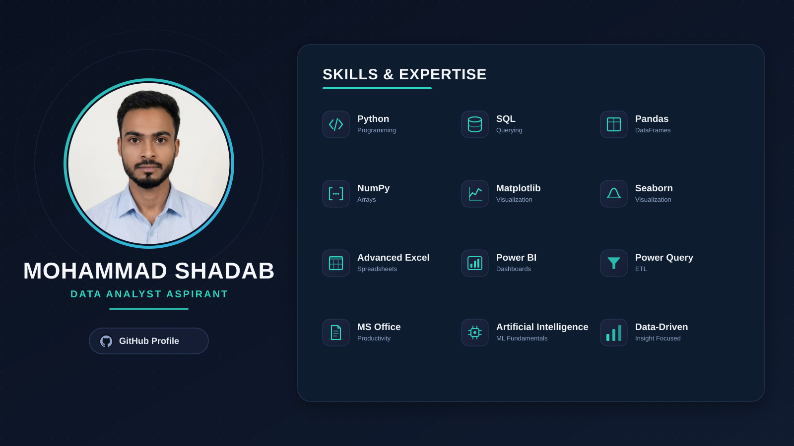

# Hi there, I'm Mohammad Shadab 👋
### Data Analyst Aspirant | Analytics & Insights

Welcome to my GitHub profile! I specialize in data cleaning, exploratory data analysis (EDA), and data visualization to derive meaningful insights.

### 📈 Profile Analytics

  
  
  

  
  

---

### 🛠️ Tech Stack & Skills Icons

  

---

### 🏷️ Detailed Tools & Technologies

#### 📊 Data Analytics & Visualization

#### 🗄️ Database & Querying

#### 🐍 Programming & Data Handling

#### 💻 Productivity & Office Tools

---

### 📌 Featured Projects

<table>
<tr>
<td width="100%">

**📊 [Ecommerce Sales & Customer Analysis](https://github.com/Mohammadshadab1/ecommerce-sales-customer-analysis)**

End-to-end EDA on 12K+ e-commerce transactions — data cleaning, KPI analysis, customer segmentation, and business insight generation.

`Python` `Pandas` `NumPy` `Matplotlib` `Seaborn`

**📊 [Employee Performance & Productivity Analytics](https://github.com/Mohammadshadab1/employee-performance-analysis)**

End-to-end EDA on 12K+ e-commerce transactions — data cleaning, KPI analysis, customer segmentation, and business insight generation.

`Python` `Pandas` `NumPy` `Matplotlib` `Seaborn` `Jupyter-Notebook` `Power-BI` `DAX`

⭐ Star this repo if you find it useful!

</td>
</tr>
</table>

> More projects coming soon — stay tuned! 🚀

---

### 🎓 Certifications

<table>
<tr>
<td align="center" width="33%">
  
<b>Meta Data Analyst Professional Certificate</b>  

</td>
<td align="center" width="33%">
  
<b>Microsoft Excel Professional Certificate</b>  

</td>
<td align="center" width="33%">
  
<b>Microsoft Power BI Data Analyst Associate</b>  

</td>
</tr>
</table>

---

### 🌐 Connect & Portfolio

