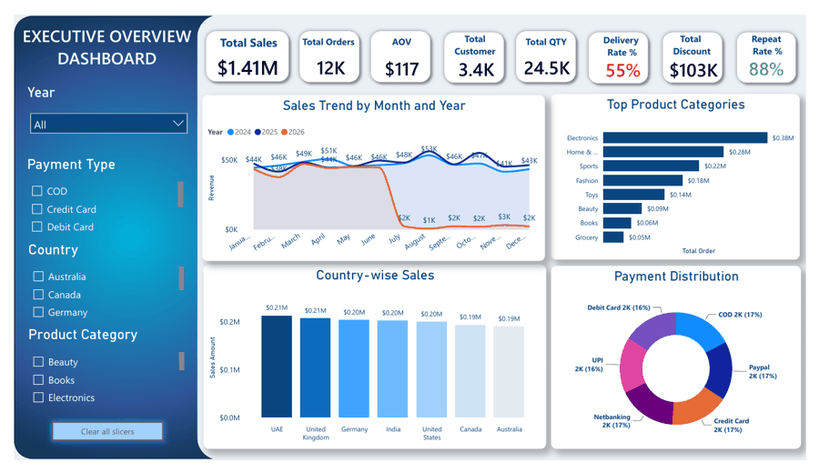
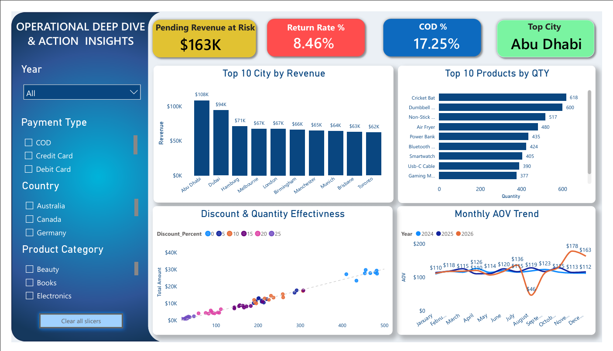
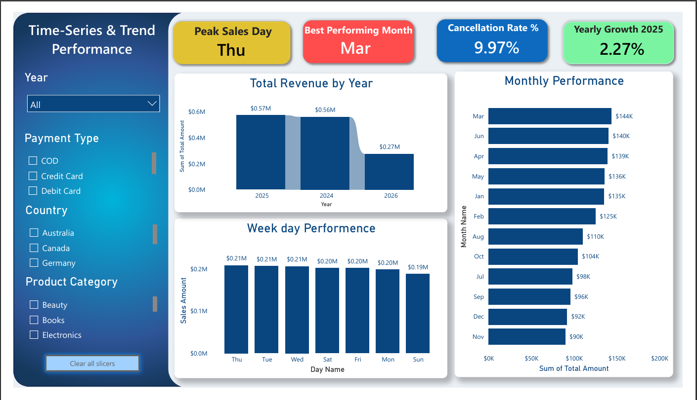
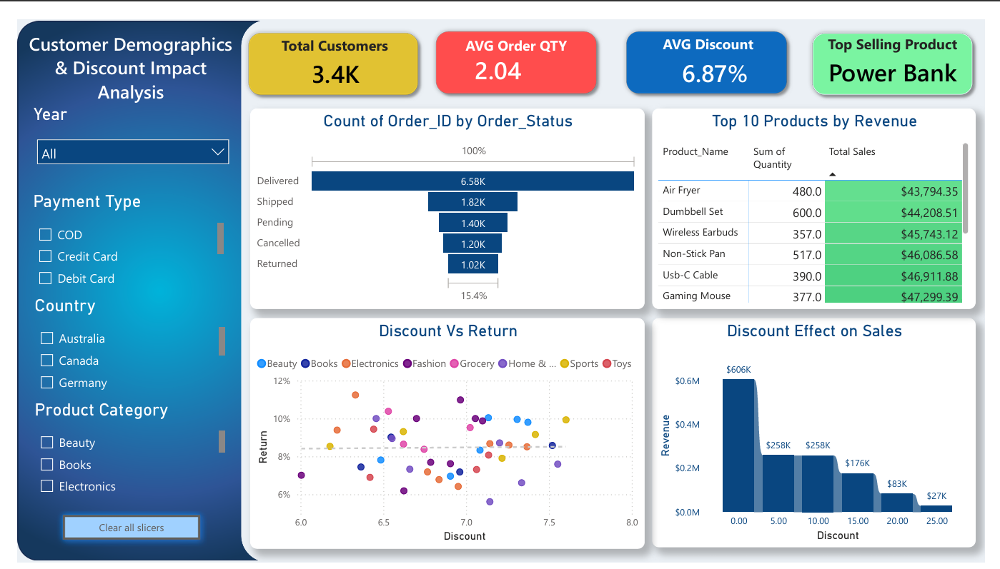
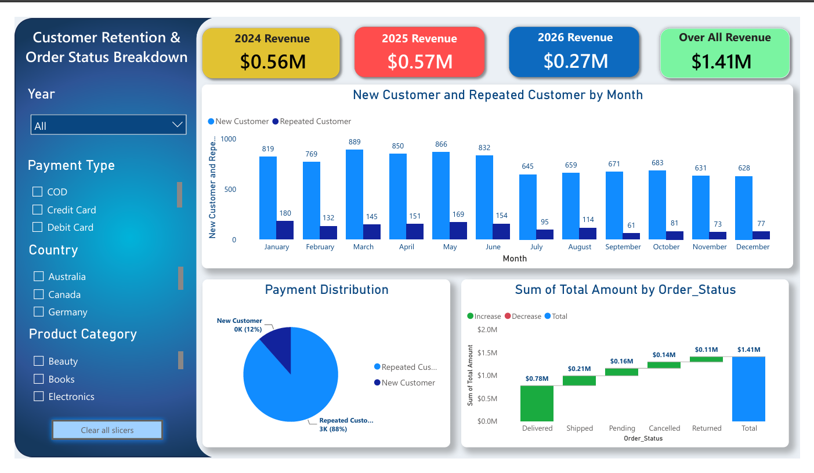
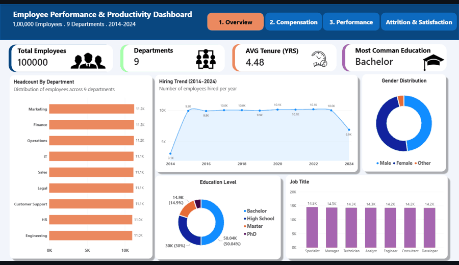
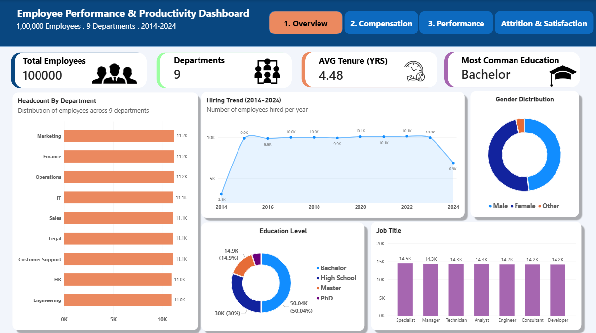
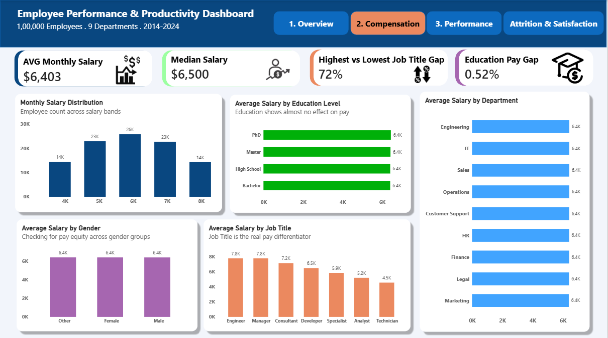
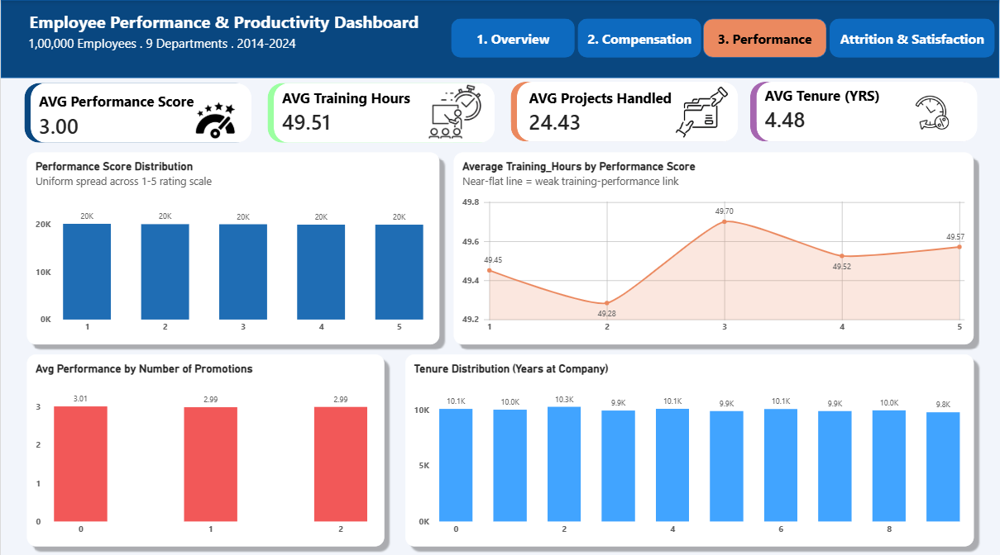
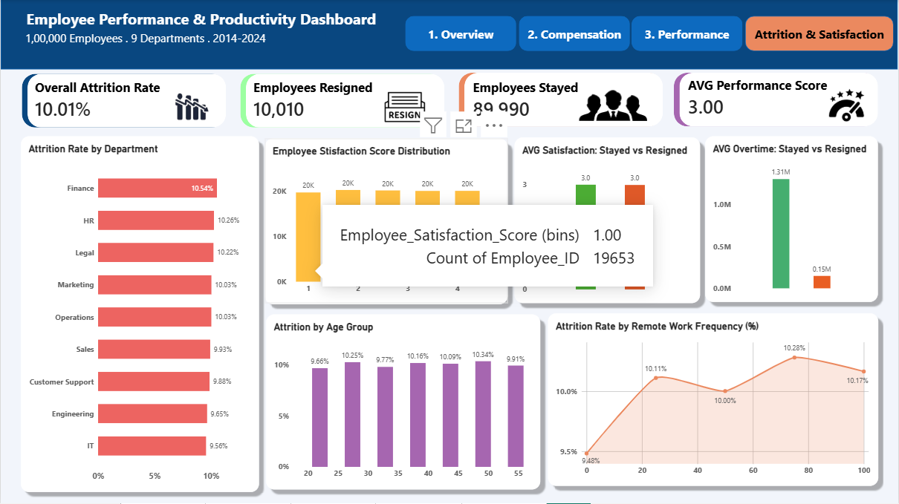

# Mohammad Shadab

### Data Analyst | Turning Raw Data into Actionable Insights

I specialize in **data cleaning, exploratory data analysis (EDA), dashboarding, and business intelligence** — helping teams make data-driven decisions through clear, compelling visual stories.

---
### 📈 Profile Analytics

  
  
  

  
  

---

## 🛠️ Tech Stack

  

**📊 Analytics & Visualization**

**🗄️ Database & Querying**

**🐍 Programming**

**💻 Productivity**

---

## 📌 Featured Projects

<table>
  <!-- ───────────────────────── Project 1 ───────────────────────── -->
  <tr>
    <td width="42%" align="center" valign="top">
      
       
      🖼️ click a thumbnail to view full size 
      
      
      
      
      
    </td>
    <td width="58%" valign="top">
      <h3>📊 Ecommerce Sales & Customer Analysis</h3>
      
End-to-end EDA on <b>12K+ e-commerce transactions</b> — data cleaning, KPI analysis, customer segmentation, and business insight generation.

      

        
        
        
        
        
      

      

        
        &nbsp; ⭐ Star if you find it useful!
      

      

        
📸 View all screenshots

         
           
           
           
           
           
      

    </td>
  </tr>

  <!-- ───────────────────────── Project 2 ───────────────────────── -->
  <tr>
    <td width="42%" align="center" valign="top">
      
       
      🖼️ click a thumbnail to view full size 
      
      
      
      
    </td>
    <td width="58%" valign="top">
      <h3>📊 Employee Performance & Productivity Analytics</h3>
      
HR & People Analytics on <b>100K employee records (2014–2024)</b>. Job title drives pay (72% gap), attrition holds flat at 10%, and satisfaction doesn't predict exits. 
      Includes Python EDA, interactive Power BI dashboard, animated PPTX, and PDF report.

      

        
        
        
        
        
        
        
      

      

        
        &nbsp; ⭐ Star if you find it useful!
      

      

        
📸 View all screenshots

         
           
           
           
           
      

    </td>
  </tr>
</table>

> 🚀 More projects coming soon — stay tuned!
---

  
## 🎓 Certifications

<table>
<tr>
<td align="center" width="33%">
  
<b>Meta Data Analyst Professional Certificate</b>  

</td>
<td align="center" width="33%">
  
<b>Microsoft Excel Professional Certificate</b>  

</td>
<td align="center" width="33%">
  
<b>Microsoft Power BI Data Analyst</b>  

</td>
</tr>
</table>

---

## 🌐 Let's Connect & Collaborate

I'm always open to discussing data projects, analytics roles, or freelance collaborations. Reach out through any of the channels below — I usually respond within a day.

<table>
<tr>
<td align="center" width="33%">

 <b>Portfolio</b> 
Case studies & project deep-dives  

</td>
<td align="center" width="33%">

 <b>LinkedIn</b> 
Experience, endorsements & updates  

</td>
<td align="center" width="33%">

 <b>GitHub</b> 
Code, notebooks & dashboards  

</td>
</tr>
</table>

 

> 💡 **Open to:** Data Analyst roles &nbsp;•&nbsp; Freelance dashboard/reporting projects &nbsp;•&nbsp; Collaboration on open-source analytics work

*⭐ If any of my work helped you, consider starring the repo — it really does help!*

